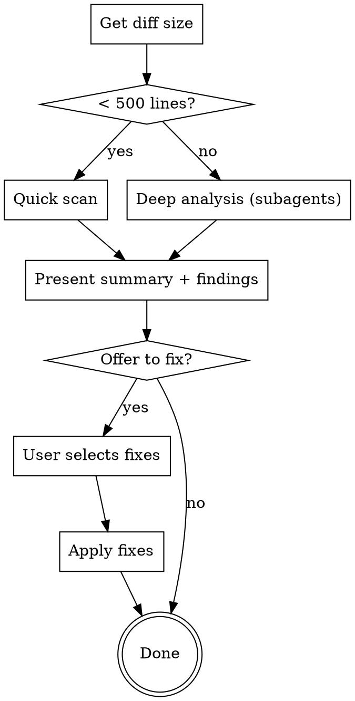

# Local Branch Code Review

Review all changes on current branch vs base branch. Reports findings by severity with file:line references. Focus exclusively on changed code and its immediate context. Ignore changes that come from merge commits.

## Process



## Step 1: Validate & Detect Base Branch

```bash
# Validate git repo
git rev-parse --git-dir

# Detect base branch (in order)
# 1. Use argument if provided
# 2. Check for 'main'
# 3. Check for 'master'
# 4. Use git default
git show-ref --verify --quiet refs/heads/main && echo "main" || \
git show-ref --verify --quiet refs/heads/master && echo "master" || \
git symbolic-ref refs/remotes/origin/HEAD 2>/dev/null | sed 's@^refs/remotes/origin/@@'

# Validate not on base branch
current=$(git branch --show-current)
# If current == base, abort with message
```

## Step 2: Analyze Diff Size

```bash
# Get total lines changed
git diff $(base)...HEAD --stat | tail -1
# Parse: "X files changed, Y insertions(+), Z deletions(-)"
# If Y + Z < 500 → quick scan
# If Y + Z >= 500 → deep analysis
```

## Step 3: Review Categories

| Category | Priority | Checks |
|----------|----------|--------|
| Security | Critical/High | Hardcoded secrets, injection vectors, auth issues, unsafe deserialization |
| Bugs | Critical/High | Null handling, off-by-one, race conditions, unhandled promises, resource leaks |
| Performance | Medium | N+1 queries, expensive loops, memory leaks, bundle impact |
| Code Quality | Medium/Low | Dead code, complexity, missing error handling, style |
| Test Coverage | Medium | Untested code paths, missing edge cases |

**Quick scan:** Read diff directly, check each category.

**Deep analysis (500+ lines):**

1. Group files by domain
2. Spawn parallel subagents (max 5):
   - Security agent scans all files
   - Per-file agents review logic + tests
3. Aggregate results

## Step 4: Output Format

```markdown
## Review Summary

Branch: `feature/xyz` → `main`
Files changed: N | Lines: +X / -Y
Review depth: Quick scan | Deep analysis

| Severity | Count |
|----------|-------|
| Critical | N     |
| High     | N     |
| Medium   | N     |
| Low      | N     |

## Critical

### [SEC-01] Issue title
`path/to/file.ts:47`
Description of issue and suggested fix.

## High
...

## What's Next?

Would you like me to address any of these findings?
- Fix all Critical issues
- Fix specific issues (e.g., "SEC-01, BUG-01")
- Skip and continue
```

## Step 5: Fix Workflow

When user selects fixes:

1. Create TodoWrite with selected findings
2. For each fix:
   - Read file context
   - Apply fix
   - Mark todo complete
3. Offer to re-review fixed files

| Category | Fix Approach |
|----------|--------------|
| Security | Apply fix, warn if needs verification |
| Bugs | Fix logic, add defensive checks |
| Performance | Ask before applying (may change behavior) |
| Code Quality | Auto-fix (safe refactors) |
| Test Coverage | Offer to write missing tests |

## Common Mistakes

| Mistake | Instead |
|---------|---------|
| Reviewing base branch | Check current != base first |
| Missing context in deep review | Always read imports and related files |
| Fixing without asking | Always present findings first, let user choose |
| Overwhelming output | Group by severity, use IDs for reference |
