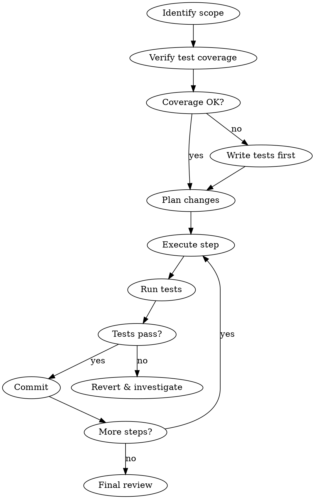

# Structured Refactoring

Safe, systematic approach to code restructuring. Ensures behavior preservation through tests, makes atomic changes, and validates at each step.

## Core Principles

1. **Never refactor without tests** - If tests don't exist, write them first
2. **Atomic changes** - Each refactor step should be independently verifiable
3. **Preserve behavior** - Refactoring changes structure, not behavior
4. **Commit often** - Small commits make rollback easy

## Process Overview



## Step 1: Identify Refactoring Scope

Ask user or infer:

| Refactoring Type | Scope | Risk |
|------------------|-------|------|
| Rename symbol | Single file or cross-file | Low |
| Extract function | Single function → two | Low |
| Extract class/module | Single file → multiple | Medium |
| Move file/directory | Cross-file imports | Medium |
| Change interface | All callers | High |
| Architectural change | Multiple systems | High |

## Step 2: Verify Test Coverage

Check if tests exist for affected code. Run the project's test suite to establish baseline.

**Coverage requirements:**

| Risk Level | Minimum Coverage |
|------------|------------------|
| Low | Tests exist for affected function |
| Medium | 80%+ line coverage |
| High | 90%+ coverage + integration tests |

If coverage is insufficient, **write tests first** before refactoring.

## Step 3: Plan the Refactoring

Break into atomic steps. Each step must:

- Be completable in < 5 minutes
- Leave code in working state
- Be independently testable

Example plan for "Extract service class":

```markdown
1. [ ] Create new file with empty class
2. [ ] Copy first method to new class
3. [ ] Update original to delegate to new class
4. [ ] Run tests - verify passing
5. [ ] Repeat for remaining methods
6. [ ] Remove delegation, update callers
7. [ ] Delete old code
8. [ ] Final test run
```

## Step 4: Execute Each Step

For each planned step:

1. **Make the change** - Single focused edit
2. **Run tests immediately** - Don't batch changes
3. **If tests pass** - Commit with descriptive message
4. **If tests fail** - Revert and investigate

## Step 5: Common Refactoring Patterns

### Rename Symbol

1. Use LSP rename when available (handles all references)
2. If manual: search for all usages, update each, test after each file
3. Run tests after completing rename

### Extract Function

1. Identify code block to extract
2. Identify inputs (parameters) and outputs (return value)
3. Create new function with clear name
4. Replace original code with function call
5. Test

### Extract Class/Module

1. Create new file with class skeleton
2. Move one method at a time
3. Update imports incrementally
4. Keep old file delegating until complete
5. Remove delegation layer last

### Change Function Signature

1. Create new function with new signature
2. Have old function call new function
3. Update callers one at a time
4. Remove old function when all callers updated

## Step 6: Validation Checklist

Before declaring refactoring complete:

- [ ] All tests pass
- [ ] No new lint warnings
- [ ] No dead code left behind
- [ ] Imports are clean (no unused)
- [ ] No temporary delegation/wrapper code remains
- [ ] Commit history is clean and atomic

## Red Flags - Stop and Reassess

- Tests start failing and you're not sure why
- Refactoring scope keeps expanding
- You're tempted to "fix bugs while you're in there"
- Changes touch more than 10 files unexpectedly

## IDE Integration (Neovim)

When connected to Neovim, leverage LSP diagnostics for real-time feedback:

### Available IDE Tools

| Tool | Purpose |
|------|---------|
| `mcp__ide__getDiagnostics` | Get LSP errors/warnings from editor |

### Usage During Refactoring

1. **Before refactoring** - Check for existing errors in target files
   ```
   getDiagnostics(uri: "file:///path/to/file.ts")
   ```

2. **After each step** - Verify no new LSP errors introduced
   ```
   getDiagnostics()  # All open files
   ```

3. **Validate imports** - LSP will flag missing/unused imports immediately

4. **Type errors** - Catch type mismatches before running tests

### Workflow Integration

```
Make change → Check IDE diagnostics → Fix errors → Run tests → Commit
```

IDE diagnostics catch issues faster than test runs for:
- Type errors
- Import problems
- Undefined references
- Syntax errors

## Integration with Other Skills

- **systematic-debugging**: If tests fail during refactoring
- **local-review**: Review refactoring changes before merge
- **test-coverage**: Verify coverage before starting
